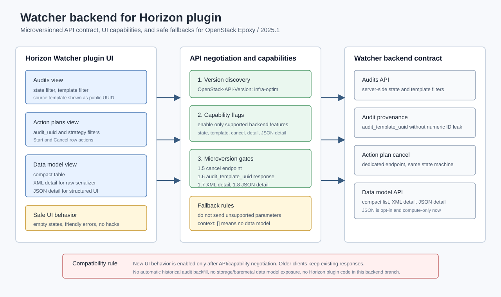
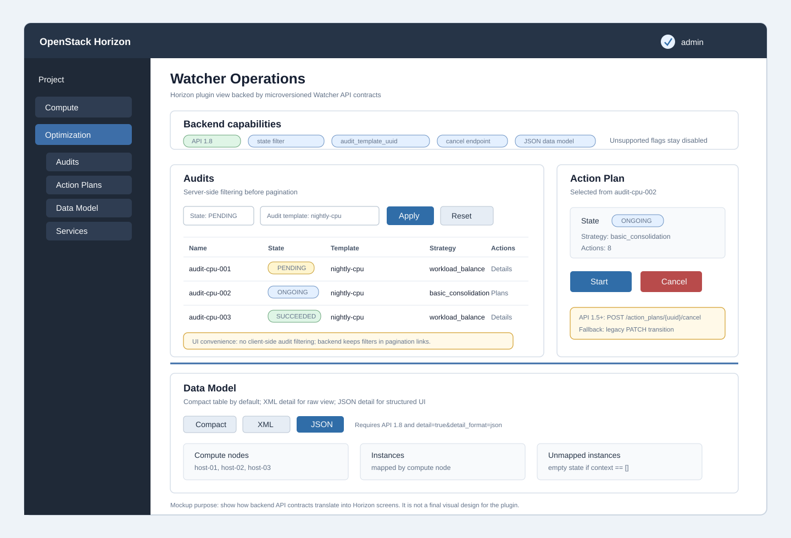

# Watcher Horizon integration overview

Этот README объясняет смысл backend-доработок Watcher для будущего отдельного
Horizon Watcher plugin: какие задачи UI они закрывают, какие удобства дают
оператору и как plugin должен безопасно интегрироваться с API Watcher.

Документ не заменяет подробные контракты:

- `docs/WATCHER_HORIZON_INTEGRATION_API_CHANGES.md` - подробный API contract;
- `docs/specs/CODEX_WATCHER_HORIZON_BACKEND_IMPLEMENTATION.md` - что
  реализовано в backend;
- `docs/specs/codex_task_watcher_horizon_plugin.md` - черновое задание для
  будущего standalone Horizon plugin.



Пример того, как эти backend-возможности могут лечь на будущий Horizon UI:



## Главная цель

Цель доработок - подготовить Watcher backend под OpenStack Epoxy / 2025.1 так,
чтобы Horizon Watcher plugin работал через нормальный REST API, без
догадок на стороне UI и без поломки существующих клиентов.

Практически это означает:

- backend сам фильтрует, связывает и валидирует данные;
- Horizon показывает понятные таблицы, фильтры и действия без client-side
  hacks;
- новые возможности включаются только через API microversions;
- старые watcherclient, OSC и существующие интеграции сохраняют прежний
  контракт.

## Какие удобства получает UI

| Backend capability | Экран Horizon | Что становится удобнее |
|---|---|---|
| `state` filter для audits | Audits list | Оператор видит только нужные состояния без загрузки и фильтрации всех audits в браузере. |
| `audit_template_uuid` filter | Audits by template | Можно открыть историю запусков конкретного audit template. |
| `audit_template_uuid` в response | Audit details/list | UI показывает источник audit без внутреннего numeric `audit_template_id`. |
| Dedicated action plan cancel endpoint | Action plans | Кнопка `Cancel` вызывает понятную команду, а не собирает JSON Patch в UI. |
| `detail=true` для data model | Data model | Можно открыть raw XML detail там, где нужен полный serializer. |
| `detail_format=json` | Data model structured view | UI получает структурированный объект для таблиц compute nodes, instances и unmapped instances. |
| Regression coverage для create/update flows | Forms and actions | Формы Horizon могут повторять OSC/API behavior без случайных несовместимостей. |

## Схемы отображения UI

### Audits view

```text
Audits
  Filters
    State: PENDING | ONGOING | SUCCEEDED | FAILED | ...
    Audit template: <template uuid/name>

  Table
    Name | State | Audit type | Goal | Strategy | Audit template | Created

  Row actions
    Show details
    Show action plans
```

Backend-смысл:

- `state` и `audit_template_uuid` уходят в Watcher API как server-side
  filters;
- pagination links сохраняют активные фильтры;
- `audit_template_uuid` читается из response body только при API `>= 1.6`;
- если capability выключен, plugin должен не отправлять неподдержанный query
  parameter и использовать безопасный fallback.

### Action plans view

```text
Action plans
  Filters
    Audit UUID
    Strategy

  Table
    UUID | State | Audit | Strategy | Created

  Row actions
    Start
    Cancel
```

Backend-смысл:

- для фильтра по audit используется `audit_uuid`, не `audit`;
- `Cancel` при API `>= 1.5` должен вызывать
  `POST /v1/action_plans/<uuid>/cancel`;
- для старых API остается fallback через существующий PATCH state transition;
- UI не должен менять state machine самостоятельно.

### Data model view

```text
Data model
  Mode
    Compact table
    XML detail
    JSON detail

  Compact table
    Node | Hostname | Server | vCPU | Memory | Disk | State

  JSON detail
    Compute nodes
      Resources
      Instances
    Unmapped instances
```

Backend-смысл:

- compact view использует старый `GET /v1/data_model`;
- XML detail доступен с API `>= 1.7` через `detail=true`;
- JSON detail доступен с API `>= 1.8` через
  `detail=true&detail_format=json`;
- `detail=true` без `detail_format=json` всегда остается XML behavior;
- `context == []` означает, что scoped/latest data model недоступна, и UI
  должен показать empty state, а не ошибку парсинга JSON.

## Capability negotiation

Horizon plugin должен начинать работу с discovery поддерживаемой версии API и
включать возможности консервативно:

```python
WATCHER_BACKEND_SUPPORTS_AUDIT_STATE_FILTER = True
WATCHER_BACKEND_SUPPORTS_AUDIT_TEMPLATE_FILTER = True
WATCHER_BACKEND_EXPOSES_AUDIT_TEMPLATE_UUID = True  # API >= 1.6
WATCHER_BACKEND_SUPPORTS_ACTION_PLAN_CANCEL = True  # API >= 1.5
WATCHER_BACKEND_SUPPORTS_DATA_MODEL_DETAIL = True  # API >= 1.7
WATCHER_BACKEND_SUPPORTS_DATA_MODEL_JSON_DETAIL = True  # API >= 1.8
```

Правило простое: если capability не подтвержден, UI не отправляет связанный
query parameter или endpoint call.

## Microversion map

| API | Возможность | UI fallback ниже версии |
|---|---|---|
| `1.5` | Dedicated action plan cancel endpoint | PATCH state transition для cancel. |
| `1.6` | `audit_template_uuid` в audit responses | Не показывать source template field. |
| `1.7` | `detail=true` для data model XML detail | Показывать compact data model. |
| `1.8` | `detail_format=json` для structured data model | Использовать XML detail или compact view. |

Server-side audit filters `state` и `audit_template_uuid` являются backend
capabilities этой ветки. Plugin должен включать их только когда развернут
соответствующий backend.

## Почему это лучше для оператора

1. Меньше ручной работы: списки audits и action plans сразу открываются в
   нужном срезе.
2. Меньше ошибок UI: plugin не восстанавливает связи между audit и template
   по имени, goal или strategy.
3. Быстрее страницы: фильтрация выполняется до pagination на стороне backend.
4. Понятнее действия: cancel action plan выглядит как отдельная команда.
5. Лучше диагностика: data model можно открыть как compact table, raw XML или
   structured JSON.
6. Безопаснее upgrade: новые возможности включаются через microversions и
   capability flags.

## Что не входит в scope

- Код самого Horizon plugin.
- Интеграционные тесты plugin-а.
- Автоматический backfill старых audits для `audit_template_id`.
- Расширение REST data model на `storage` или `baremetal`.
- Изменение поведения старых API microversions.

## Где запускать и проверять

Backend Watcher удобнее запускать и тестировать из репозитория:

```text
/Users/dmitry/Desktop/DRS:HA_fork/watcher
```

В этой ветке тесты запускались из colon-free mirror:

```text
/private/tmp/watcher-src-no-colon
```

Будущий Horizon Watcher plugin должен жить отдельным репозиторием и
интегрироваться с Watcher через REST API, не импортируя backend-код Watcher.
